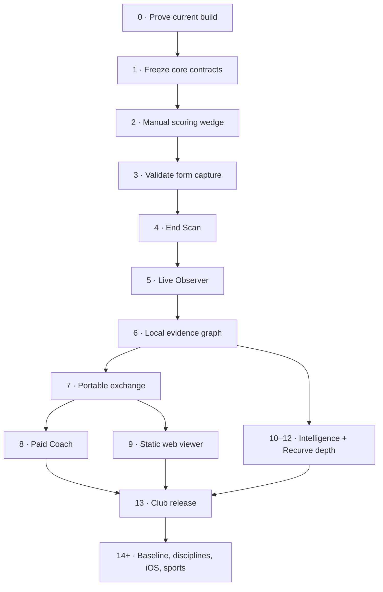

<!-- markdownlint-disable MD013 MD024 MD025 MD060 -->

# Crocodyl Phased Implementation Plan v1.0

**Status:** Proposed execution plan  
**Date:** 2026-08-10  
**Authority:** Implements `Crocodyl Product Blueprint v2.1`  
**Starting build:** `v0.5.0-everything`—CI-green, Android behavior not yet verified  
**Primary launch:** Android · Olympic Recurve · one coach and one club squad  
**Operating model:** Local-first · no maintained backend · free/open athlete product · paid/open-source Coach and Baseline surfaces

---

## 1. Executive decision

Crocodyl is not one ordinary mobile app. The target contains an Android scorer, two computer-vision systems, a local performance database, a secure file-exchange protocol, a paid multi-athlete coach product, a static desktop viewer, an equipment knowledge system, health-adjacent recovery guidance, and multiple AI runtimes. Trying to build all of those at once will produce a large unverified codebase rather than a trustworthy product.

The implementation order is therefore:

1. Prove the existing APK and stop silent data-loss behavior.
2. Freeze the observation, correction, provenance, and privacy contracts.
3. Ship a fast manual Recurve scorer that the club can use every week.
4. Make form capture reliable on real devices.
5. Add End Scan, then Live Observer; keep Paired Target Cam post-v1.
6. Join form, scores, equipment, conditions, body, habits, and training without inventing precision.
7. Complete portable exchange before building the paid Coach workflow or web viewer.
8. Add model choice, equipment intelligence, and recovery planning on top of real history.
9. Freeze features, run the club pilot, and harden Recurve v1.
10. Add paid Baseline insights, then disciplines, iOS, and new sports one at a time.

### 1.1 Non-negotiable sequencing rule

Data capture begins early; sophisticated advice comes late. Basic rig snapshots, equipment changes, weather/conditions, pain/soreness/stiffness, habits, training intent, corrections, and source confidence must exist before the insight surfaces that consume them. Otherwise Crocodyl will reach v1 with no trustworthy longitudinal history.

### 1.2 Delivery reality

For a focused team of six to eight experienced contributors, the earliest credible Recurve v1 is approximately **20–24 months** from approved start. A three-person team should plan for **30–42 months**. A solo build at the specified quality is a multi-year project, likely **four years or more**. AI coding assistance can reduce implementation time; it does not remove range testing, dataset creation, device coverage, security review, accessibility work, clinical review, or pilot learning.

Do not publish a date until Phase 0 exposes the real state of the Android build and form pipeline.

## 2. Scope and finish line

### 2.1 Recurve v1 finish line

Recurve v1 is the first public, store-quality club release. It includes:

- fast manual numeric and plotted scoring;
- editable automatic End Scan;
- Live Observer tap and constrained offline voice scoring during form capture;
- validated sagittal form capture and review;
- honest local performance trends and associations;
- Recurve rigs, equipment lifecycle, catalog, wear, tuning, and neutral upgrade guidance;
- training, goals, events, calendar, body state, habits, rest, and conservative recovery guidance;
- signed `.croc` exchange and `.crocbak` backup/restore;
- paid human Coach workspace in official builds;
- static local-only web viewer;
- offline rules, on-device model support, and BYOK providers including DeepSeek;
- accessibility, privacy, migrations, security, localization foundations, and real-device support.

Recurve v1 does not require Paired Target Cam, Wear OS, Health Connect, iOS, Compound, Korean/traditional archery, server tournaments, a social network, or paid Baseline causal insights.

### 2.2 Program finish line

The broader program is complete only after the common contracts are proven across Recurve v1, paid Baseline insights, Compound, Korean/traditional archery, iOS athlete parity, Fencing as the first non-archery validation, Swimming, and Rock climbing. There is no credible “all sports” platform claim before Fencing ships without archery-specific leakage into the common core.

## 3. Starting-state assessment

### 3.1 What exists according to the supplied status

- Gradle multi-module Kotlin/Compose project with pure-JVM cores.
- Android app shell, onboarding, profile, rigs, Home, Train, Settings, Room, CameraX, and MediaPipe wiring.
- Wellness/life/calendar, 52-region body model, pain/injury/physio, and encrypted document vault.
- Rule coach, BYOK clients, on-device model seam, privacy redaction, and AI settings.
- Initial backup/export, public-key identity seam, equipment math, and tuning UI.
- CI compilation, pure-JVM tests, stable debug signing, and APK release workflow.

### 3.2 What does not yet count as done

- Android UI and wiring have not been behaviorally verified on real devices.
- Existing recovery and readiness behavior has not passed clinical-content or athlete-comprehension review.
- Existing `.crocbak` export is not the complete signed `.croc` person-to-person protocol.
- Scoring, round packs, plotting, progress, target vision, Live Observer, Coach workspace, and web viewer are not delivered.
- Model installation is manual; DeepSeek and the common provider UX are incomplete.
- Current self-healing database behavior may rebuild an incompatible database. That is acceptable for an internal test build only; a production build must never silently delete athlete history.
- The branch/default-branch and earlier pull-request decisions remain unresolved.
- The status document calls Baseline private, while the approved product direction says paid Baseline features remain open-source. Keep its implementation separate from Crocodyl if desired, but resolve the publication/license path before Baseline 1.1.

The plan treats every “built” claim as provisional until it passes source audit, device QA, range QA, and migration tests.

## 4. Program laws

| Law | Implementation consequence |
|---|---|
| Real use before breadth | The club uses manual scoring before target AI, Coach, or multi-sport expansion is called complete. |
| Local source of truth | No feature may require a Crocodyl service to create, read, analyze, share, or restore athlete data. |
| Schema before surface | Observation resolution, provenance, corrections, privacy, and migrations are fixed before downstream UI proliferates. |
| Human confirmation | Machine scores, observer matches, imported data, and medical-adjacent conclusions never become authoritative silently. |
| Evidence before language | Deterministic/testable engines produce measurements; language models only explain grounded results. |
| No precision inflation | End-, session-, day-, and period-level facts are never presented as shot-level evidence. |
| Free athlete loop | Scoring, form, equipment, recovery, export, Live Observer, local AI, and BYOK remain free. |
| Paid surfaces stay open | Coach and Baseline are entitlement-gated in official builds, not hidden-source components. |
| Commerce cannot steer evidence | Offers and commissions enter only after an equipment recommendation is finalized. |
| No silent collection | Diagnostic, contribution, media, medical, and private exports require explicit preview and action. |
| Outcome gates beat dates | A release slips if its exit gate fails; the gate is not rewritten to protect a date. |

## 5. Delivery map

### 5.1 Release overview

| Phase | Release | Outcome |
|---|---|---|
| 0 | 0.5.1 | Verified, installable, non-destructive baseline |
| 1 | Internal foundation | Stable data/evidence/privacy contracts |
| 2 | 0.6.0 | Fast manual Recurve scorer used weekly |
| 3 | 0.7.0-A | Range-valid form capture and review |
| 4 | 0.7.0-B | Editable post-end target scoring |
| 5 | 0.7.0-C | Live spotter scoring during form capture |
| 6 | 0.7.0-D / 0.12 foundation | Resolution-safe local evidence and associations |
| 7 | 0.8.0 | Signed exchange, backup, restore, consent |
| 8 | 0.9.0 | Paid Coach pilot loop |
| 9 | 0.10.0 | Static local-only desktop viewer |
| 10 | 0.11.0 | DeepSeek/BYOK/on-device intelligence UX |
| 11 | 0.12.0-A | Equipment catalog, lifecycle, and recommendations |
| 12 | 0.12.0-B | Training, goals, recovery, and Recurve parity |
| 13 | 1.0.0 | Hardened public club release |
| 14 | 1.1.0 | Paid Baseline association and eligible causal insights |
| 15 | 1.x experiment | Paired Target Cam and optional wearables |
| 16 | 1.2.0 | Compound discipline |
| 17 | 1.3.0 | Korean/traditional discipline |
| 18 | 1.4.0 | Native iOS athlete client |
| 19 | 2.0.0 | Fencing sport module |
| 20 | 2.x | Swimming module |
| 21 | 2.x | Rock-climbing module |

The checkpoint suffixes are planning gates, not promises of public semantic versions.

---

# Part I — Recurve implementation phases

## 6. Phase 0 — Prove the current build

**Release:** 0.5.1  
**Purpose:** Establish the truth before extending the codebase.

Resolve the authoritative branch/default branch; inventory modules, schemas, migrations, secrets, signing, variants, and licenses; establish Android/device CI; run fresh/update installs; exercise all existing flows; capture real sagittal Recurve sessions indoors/outdoors for both handednesses; replace destructive database recovery with migration → diagnostic/export → explicit reset; add local redacted support bundle; and time-box Hyle integration.

**Exit gate:** Thirty real sessions across at least three device classes; final ten without blocking crash/data loss; update-install retains supported tables; capture quality/thermals/device floor documented; every current screen QA-recorded; branch/license/signing/OTF/Coach entitlement have owners and dates.

If sagittal capture is not reliable, continue manual scoring while vision remains a blocked track.

## 7. Phase 1 — Freeze the core contracts

Introduce stable IDs and typed payloads for Athlete, Sport Profile, Discipline, Session, End, Shot/Attempt, Observation, Result, Rig, Equipment Item/Model, Target Observation, Observer Score Event, Correction, Habit Event, Training Plan, Goal, Intervention, Causal Study, Insight, and Exchange Envelope. Separate owned items, catalog models, evidence, and merchant offers. Preserve provenance, confidence, corrections, authoritative state, privacy class, validity interval, clock ordering, and observation resolution (`SHOT_CONFIRMED`, `SHOT_INFERRED`, `END_ONLY`, `SESSION_ONLY`, `DAY_WINDOW`, `PERIOD_WINDOW`).

Publish early contracts for rounds/targets, observations/corrections, `.croc`, `.crocbak`, equipment provenance, algorithm/model cards, health-rule cards, and compatibility/deprecation. Every supported database version must migrate; coarse observations must never be promoted to shot level.

## 8. Phase 2 — Ship the manual Recurve scoring wedge

Deliver Quick Add, pinned/last-used sessions, WA Recurve round pack, custom practice, cold-thumb numeric scoring, synchronized plotting, totals/set points/PBs, basic grouping, sight marks, and interruption-safe session history. Capture rig/equipment, venue/conditions, training intent/volume, optional body state, habits/sleep, time window, correction state, and privacy class from day one without making optional context mandatory.

Pilot with one coach and 5–10 Recurve archers. The gate is ≤2 taps / ≤10 seconds to resume, ≤20-second median six-arrow end, consistent totals, interruption-safe state, glove/sunlight usability, and voluntary repeated use.

## 9. Phase 3 — Make form capture credible

Build the sagittal placement wizard, pre-flight quality gate, explicit degradation states, single handedness normalization point, stable shot detection, configurable raw-media retention, phase-aligned replay, metric definitions/confidence/versioning, personal-baseline states, side-by-side comparison, and rule coaching grounded in exact facts/drills.

Evaluate on consented held-out athletes/devices/conditions. Unsupported or unstable features do not reach advice.

## 10. Phase 4 — Add editable End Scan

Provide completed-end camera/import, target calibration, perspective correction, arrow/impact candidates, normalized coordinates, ring/line-cutter scoring, per-candidate confidence, and a correction inspector supporting add/remove/drag/rescore/miss/unresolved. Preserve machine candidate + human correction + authoritative final + model version. Default linkage is `END_ONLY` unless arrow order is explicitly assigned.

Launch only inside a measured target/device/lighting envelope with mandatory reconciliation for low-confidence or count-mismatch cases.

## 11. Phase 5 — Add Live Observer

Support paired-device target tap, paired-device push-to-talk/bounded voice, and same-device bounded post-shot voice where safe. Grammar is deliberately constrained: `X`, `10`–`1`, `miss`; optional 3×3 sector; `repeat`, `undo`, `skip`, `finish end`, `correct arrow <n>`. Raw audio is not retained by default and recognition does not silently use cloud speech.

Use short-lived local pairing, clock-offset/order tracking, immediate acknowledgement, transparent inferred/confirmed linkage, and end reconciliation. Pairing loss never stops form capture. If voice false acceptance cannot meet the range gate, ship tap and keep voice experimental.

## 12. Phase 6 — Build the local evidence graph and free analytics

Align form, scores, rig/equipment intervals, conditions, training, body, physiology when present, and opted-in habits. Fine data may aggregate coarser; coarse data never promotes finer. Expose join decisions, unmatched observations, clock tolerance, corrections, source, and algorithm versions.

Free analysis covers scores/PBs, volume/load, form stability, group drift, sight marks, equipment filters, intervention markers, and association cards with effect, uncertainty, sample/window, resolution, lag, and plausible confounders. Causal percentages remain out of scope until paid Baseline has an eligible study design.

## 13. Phase 7 — Complete sovereign exchange and recovery

Finish signed versioned `.croc` envelopes, public-key identity, Pairing Card, TOFU pinning, key mismatch quarantine, Android share/open/picker flows, signature/import preview, dedupe/conflicts, and `.crocbak` full recovery with version compatibility. Enforce shareable/raw-media/private/medical/secret classes centrally. Private categories are never in bulk consent; medical/raw media require explicit ceremony.

Gate with repeated real transport loops, cross-version restore, malicious/tampered/duplicate/unknown-newer fixtures, privacy leak tests, and exact preservation of corrections, provenance, linkage resolution, equipment evidence, and insight grade.

## 14. Phase 8 — Deliver the paid human Coach pilot

Choose commercial entitlement behavior before production. Keep DRM simple and explicit because the paid surface is open-source. Deliver roster, attention inbox, athlete detail, timestamped coach observations, drill/plan library, signed assignments, athlete acknowledgement, coach-local score book, comparison, retention/purge/report-age states, and missing-consent handling.

The gate is a real coach managing at least five athletes for four weekly cycles through file transport only, closing report → note → assignment → completion → acknowledgement without changing athlete historical facts.

## 15. Phase 9 — Deliver the static web viewer

Build a static PWA for GitHub Pages/Cloudflare/Vercel-style hosting. Files are opened locally, signatures/schemas/consent/integrity are inspected locally, and Overview/Sessions/Scores/Plots/Form/Equipment/Body/Calendar/Insights render without uploading report bytes. PDF/CSV/share-card export stays local. Persistence is ephemeral by default with optional clearable IndexedDB.

## 16. Phase 10 — Complete intelligence choice

Separate AI from the human Coach domain. Use one provider adapter for URL/auth/model discovery/streaming/cost/cancellation/error handling, with DeepSeek plus OpenAI/Anthropic/Google. Keep keys in Keystore, expose sent/withheld facts, support guided local-model import, evaluate LiteRT-LM before migration, and always fall back to deterministic rules on unsupported hardware. Fixed intents precede free chat.

## 17. Phase 11 — Build equipment intelligence and neutral commerce

Complete Recurve equipment lifecycle, immutable rig snapshots, individual arrows, tuning history, sight marks, and interventions. Build a signed static catalog from permitted manufacturer specs/manuals, licensed feeds/APIs, structured data, permissioned crawling, community contributions, and licensed tests. Preserve field-level provenance/license/retrieval/parser/confidence/corrections. Unknown stays unknown.

Recommendation order is keep → adjust → inspect/service → repair → borrow/test → buy. Merchant, stock, price, affiliate, commission, campaign, and payout are prohibited recommendation inputs. Offers attach after ranking with adjacent disclosure and canonical references.

## 18. Phase 12 — Complete training, goals, recovery, and Recurve parity

Deliver plans, calendar overlays, goals, events, training games, pressure simulations, conditions/venues, completed-vs-planned reconciliation, and complete body/recovery. Preserve existing wellness/body/injury/physio/vault data. Distinguish soreness/stiffness/pain; use multi-input readiness; treat ACWR only as one contextual measure; use a reviewed versioned action library; keep advice conservative/overrideable/non-diagnostic; jurisdiction-review red flags and return-to-training content.

Close every P0/P1 Recurve parity row or record an explicit owner-approved exclusion. Advanced modules may not slow the two-tap scoring path.

## 19. Phase 13 — Freeze, pilot, and release Recurve v1

After feature freeze, only blockers, data-loss prevention, performance/battery/thermal/storage/accessibility, migration/recovery, privacy/safety/store compliance, measured model/data improvements, and pilot-driven repairs enter. Run a four-week club pilot with one coach, at least five active Recurve archers, handedness/skill/device diversity, and weekly scoring/form/End Scan/Live Observer/equipment/body/report/coach/web/backup tasks.

Release engineering includes source license, reproducible signed build, Play/GitHub release, privacy/threat/data-safety/health declarations, third-party/model licenses, affiliate disclosure, contributor/security channels, supported-device policy, migration/rollback/restore/EOL policy, and static-web source/deployment.

If the club does not keep using Crocodyl, v1 is not ready regardless of feature count.

---

# Part II — Post-v1 expansion

## 20. Phase 14 — Paid Baseline insights

Baseline receives a separate product/statistical/privacy/commercial specification. Crocodyl owns the consent-filtered `InsightInput` adapter and versioned `Insight` presentation contract. Association handles repeated measures, lag, and multiplicity. Causal studies require a declared estimand, meaningful-effect threshold, causal graph/adjustment set, intervention schedule, overlap, confounder/sensitivity plan, calibration, and suitable N-of-1/crossover design.

An eligible output may say **Estimated chance this factor materially contributed: 74%**. It must never say a factor caused 74% of performance. Coarse/ambiguous data cannot enter shot-level causal analysis; LLMs cannot choose the estimand, adjustment set, estimator, or number.

## 21. Phase 15 — Paired Target Cam experiment

Post-v1 only. Establish safe range mounting, short-lived local pairing/clock sync, new-impact detection, shot-to-impact matching, reconciliation against observer/manual/photo sources, and an explicit supported envelope. Keep experimental unless it is safer/more useful than Live Observer.

## 22. Phase 16 — Compound

Add a real discipline profile with compound terminology, release-aid/anchor/peep model, phases, equipment schema, rig validation, round packs, coaching rubric, dedicated tuning workflows, and discipline-scoped baselines. No Recurve assumptions may leak.

## 23. Phase 17 — Korean and traditional archery

Ship named tradition-specific profiles only after practitioner validation. Use correct technique phases, thumb-draw/release terminology where applicable, bow/thumb-ring/arrow/accessory schema, distances, targets, scoring, safety context, translation, and discipline-specific coaching sources.

## 24. Phase 18 — Native iOS athlete client

Deliver athlete parity without changing data semantics: sessions, scoring, plotting, capture feasibility, equipment, training/recovery, import/export, backup, and web handoff, with iOS-native camera/storage/security/share/accessibility/on-device model implementation and cross-platform golden fixtures.

## 25. Phase 19 — Fencing as the second sport

Start with one weapon and one bounded training use case. Define fencing Attempt/Result/Session/Capture/Feature/Equipment/Drill contracts, reuse shared capabilities only where meaning is actually shared, and validate the same athlete↔coach loop. Shared core must require no new archery conditionals.

## 26. Phases 20–21 — Swimming, then Rock Climbing

Swimming starts with one bounded job such as pool-session logging and video-supported stroke review; underwater capture and auto-lap detection are separate feasibility tracks. Rock climbing starts with gym route/boulder attempts, grade systems, send/fall/rest events, wall/route context, equipment lifecycle, movement video, load/body context, and coach feedback. Do not treat grades as universally comparable across gyms/systems.

Every sport requires practitioner-validated terminology/safety, sport-specific contracts, no leakage from prior sports, a local/offline athlete loop, portable coach loop, evidence-resolution rules, and its own device/accessibility/real-world pilot gates.

---

# Part III — How to execute

## 27. Critical path and parallel work

The Recurve-v1 critical path is Phase 0 truth → Phase 1 contracts → Phase 2 weekly scoring → Phase 3 form reliability → Phases 4–5 scoring/reconciliation → Phase 7 exchange → Phase 8 Coach pilot → Phases 11–12 completeness → Phase 13 hardening/retention. Target-photo data, form data, migration safety, and real club participation are more likely long poles than UI coding.

Start target-photo collection, form evaluation, equipment licensing, clinical/recovery review, exchange threat modeling, web portability, coach workflow observation, Baseline study metadata, and localization early. Do not start production multi-sport UI, general chatbot/agentic automation, target-cam production, wearable dependencies, server sync/accounts/social/leaderboards, elaborate DRM, or affiliate optimization early.

## 28. Team and ownership

A credible 20–24 month Recurve v1 assumes roughly: product owner 0.5–1, product/design 1, Android 2, CV/ML 1–1.5, data/statistics 1, web/security/platform 1, QA/release 1, plus mandatory part-time Recurve coach, 5–10 club archers, sports physiotherapist/qualified reviewer, equipment/tuning specialist, catalog licensing/affiliate reviewer, and later translators/discipline practitioners.

Every phase has one release owner empowered to delay it when the exit gate fails.

## 29. Indicative delivery schedule

| Elapsed month | Mainline work | Usable milestone |
|---|---|---|
| 0–1 | Audit/device/range proof | Honest internal build |
| 1–3 | Contracts and migrations | Stable foundation |
| 2–5 | Manual scorer | Club scoring alpha |
| 3–7 | Form capture | Form alpha |
| 5–9 | End Scan | Multimodal scoring alpha |
| 7–10 | Live Observer | Live club workflow alpha |
| 7–11 | Local evidence | Performance beta |
| 6–11 | Exchange | Sovereign sharing beta |
| 10–14 | Coach, web, model choice | Coach pilot |
| 8–17 | Equipment/training/Recurve depth | Feature-complete beta |
| 17–20 | Feature freeze/remediation | Release candidate |
| 20–24 | Club pilot/closure | Public Recurve v1 |

Planning range: solo 48+ months; three full-time contributors 30–42; six-to-eight experienced contributors 20–24. More people do not remove dataset and coordination bottlenecks.

## 30. Backlog and issue structure

Every issue names phase/release, outcome, data objects/privacy classes, schema/migration impact, offline/network behavior, acceptance criteria/fixtures, required device/range/accessibility/security evidence, dependencies/exclusions, and source attribution. Recommended labels cover `phase:*`, domain, platform, risk, evidence level, priority, blockers, and decisions.

Use short-lived feature branches from the verified default branch; small compiling commits; feature flags for incomplete paths; migrations and golden fixtures with schema changes; domain-relevant review; reproducible release artifacts with changelog/migration/evidence/known limitations.

## 31. Definition of ready and done

A story is ready only when outcome, product law/privacy class, data/migration impact, UX states, evaluation fixtures, dependencies/non-goals, and a falsifiable acceptance measure are known.

A story is done only when code/tests/migrations/accessibility/help/privacy are complete; actual supported-device behavior is exercised; range behavior is exercised for shooting features; offline/network paths are inspected; error/interruption/correction/restore are tested; evidence level is recorded; and acceptance evidence is attached.

**Compilation is evidence of compilation. It is not evidence that a user job works.**

## 32. Test and evidence program

Required layers include pure-core math/rules/privacy, schema contracts, database migrations/recovery/volume, Android navigation/permissions/camera/storage/Keystore/sharing/pairing, device tiers/thermals/light/offline, real range ergonomics, held-out vision datasets, voice false-accept/latency/noise/accent testing, malicious-file/security tests, privacy fail-closed tests, accessibility, browser/network inspection, health-content review, commerce-ranking independence, and causal-inference simulation/calibration/confounding tests.

Every model release stores a dataset manifest, consent/license state, target population/exclusions, split policy, condition/device metrics, failure modes, checksum/runtime compatibility, rollback path, and model/algorithm version on derived observations.

## 33. Product metrics without a backend

Metrics stay local and are shared only through opt-in diagnostic/research bundles or structured pilot observation. Track familiar-session start time/taps, scoring time/corrections, form valid-capture/miss/repeatability, End Scan candidate/ring/correction/confirmation results, voice acceptance/false acceptance/latency/linkage, share/import success, coach review time, voluntary weekly reuse, athlete comprehension of evidence/privacy, equipment-commerce trust, recovery comprehension, and restore integrity. Do not optimize vanity metrics such as screen time, AI-message count, catalog clicks, or affiliate conversion at the expense of training quality.

## 34. Risk register and stop conditions

Critical risks include: incomplete current APK, silent DB reset, non-repeatable form metrics, target-photo failure modes, voice corruption in range noise, unreliable local pairing, thermal load, equipment licensing, affiliate trust, medical interpretation of recovery guidance, paid entitlement performance, laborious no-backend sharing, multi-sport fragmentation, and overclaiming category leadership. Each has an explicit narrow/disable/rebaseline stop condition rather than a marketing workaround.

## 35. Competitive parity governance

Before each beta/public release, recheck major benchmark apps, update the parity matrix, classify each row as match/exceed/deliberate-no/later/unsupported, attach Crocodyl evidence, and test the user job rather than the checkbox. Do not claim category leadership until comparative tasks support it.

The intended differentiation is the combined system: sovereign sharing, three-mode scoring, linked form/outcome/context evidence, neutral equipment intelligence, recovery context, local/BYOK models, and an upload-free desktop viewer.

## 36. Decision deadlines

Resolve authoritative branch/PR disposition in Phase 0; public source license before external contributors/no later than v1 RC; production signing/distribution in Phase 0; Coach purchase model before Phase 8 production; final target vision/voice envelopes before public claims; and Baseline publication/statistical specification before Phase 14.
